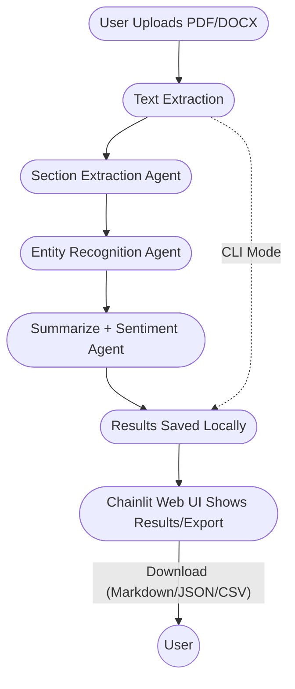

# PrivyDoc - Local Document Intelligence Tool

A **secure, on-device document analysis solution** powered by **Foundry Local**, designed to handle sensitive documents without relying on the cloud.  

      

---

## Overview

The **PrivyDoc Document Analysis Tool** transforms how teams work with sensitive documents by bringing **AI-powered analysis** directly to your device. Using **Microsoft Foundry Local**, all processing happens locally-no data leaves your computer.

**Ideal for:**  
- Policy teams analyzing internal documents  
- Researchers handling sensitive research materials  
- Legal teams reviewing confidential contracts  
- Compliance teams processing regulatory documents  
- Anyone needing document insights without uploading to the cloud  

## Key Features

### Document Processing
- ✅ **Multi-Format Support**: PDF and DOCX  
- ✅ **Structure Recognition**: Identify document sections and hierarchy  
- ✅ **Text Extraction**: Preserve formatting cues  

### AI-Powered Insights
- ✅ **Smart Summarization**: Concise overviews of entire documents or sections  
- ✅ **Entity Recognition**: Detect people, organizations, locations, dates, etc.  
- ✅ **Sentiment Analysis**: Analyze emotional tone at document and section levels  
- ✅ **Topic Classification**: Auto-categorize documents by subject  

### Security & Compliance
- ✅ **100% Local Processing**  
- ✅ **Zero Data Transmission**  
- ✅ **Air-Gap Compatible**  
- ✅ **Analysis Traceability**: Logs of all interactions  
- ✅ **Document Fingerprinting**: Verify integrity and processing history  

### Export & Integration
- ✅ **Multiple Formats**: Markdown, JSON, CSV  
- ✅ **Structured Data**: Standardized output for downstream processing  
- ✅ **Analysis History**: Browse previous analyses with metadata  

## Getting Started

### System Requirements

| Component | Requirement |
|-----------|-------------|
| OS | Windows 10/11, macOS 12+, Linux (Ubuntu 20.04+) |
| RAM | 8 GB minimum, 16 GB recommended |
| Storage | ≥ 5 GB free |
| Python | 3.8+ |

### Installation

1. **Clone the repository**

```bash
git clone https://github.com/ShivamGoyal03/PrivyDoc.git
cd PrivyDoc
```

2. **Set up Python environment**  

```bash
# Create a virtual environment
python -m venv venv

# Activate it
venv\Scripts\activate   # Windows
source venv/bin/activate  # macOS/Linux

# Install dependencies
pip install -r requirements.txt
```

3. **Install Foundry Local**

```bash
# Windows
winget install Microsoft.FoundryLocal

# macOS
brew tap microsoft/foundrylocal
brew install foundrylocal

# Verify installation
foundry --version
```

4. **Download a model (automatic on first run)**

```bash
# List available models
foundry model ls

# Download specific model (optional)
foundry model run qwen2.5-0.5b
```

## Usage

### Web Interface (Recommended)

```bash
chainlit run multi_agent_doc_analysis.py
```

* Open: [http://localhost:8000](http://localhost:8000)
* Upload PDF or DOCX, track progress, export results

### Command Line

```bash
python multi_agent_doc_analysis.py --file path/to/document.docx
```

* Process a single file and save results to local JSON database

### Supported Models

| Model        | Size   | Best For             | Notes            |
| ------------ | ------ | -------------------- | ---------------- |
| qwen2.5-0.5b | Small  | Quick analysis       | Default, fastest |
| phi-3.5-mini | Medium | Balanced performance | Good all-around  |
| phi-4        | Large  | Detailed analysis    | Most accurate    |

## Implementation Details

### Architecture

* **Document Processor**: Extracts and normalizes text
* **AI Engine**: Runs Foundry Local models
* **Analysis Workflow**: Multi-step analysis using Agent Framework
* **Storage Layer**: JSON-based analysis history
* **User Interfaces**: Web UI (Chainlit) & CLI

### Processing Flow

1. **Document Upload** (via Web or CLI)
2. **Text Extraction** (PDF/DOCX cleaned for analysis)
3. **Section Extraction** (LLM-powered agent)
4. **Entity Extraction** (NER agent identifies people, orgs, locations)
5. **Summarization & Sentiment** (Analyzer agent)
6. **Results Compilation & Storage** (saved locally in JSON)
7. **UI Feedback/Export** (Markdown, JSON, CSV)

### Processing Pipeline



### Local Storage

All results are saved in `analysis_history.json` for:

* Historical reference
* Audit purposes
* Quick retrieval without reprocessing


## Development

### Project Structure

```
PrivyDoc/
  ├── multi_agent_doc_analysis.py    # Main application
  ├── analysis_history.json          # Local analysis
  ├── requirements.txt
  └── README.md
```

### Dependencies
- `foundrylocal`: Microsoft Foundry Local SDK
- `chainlit`: Web UI framework
- `pdfplumber`: PDF text extraction
- `python-docx`: DOCX text extraction

### Contributing & License

Contributions are welcome! Fork the repo, create your feature or fix branch, and submit a PR.

Licensed under the MIT License — see [LICENSE](LICENSE).